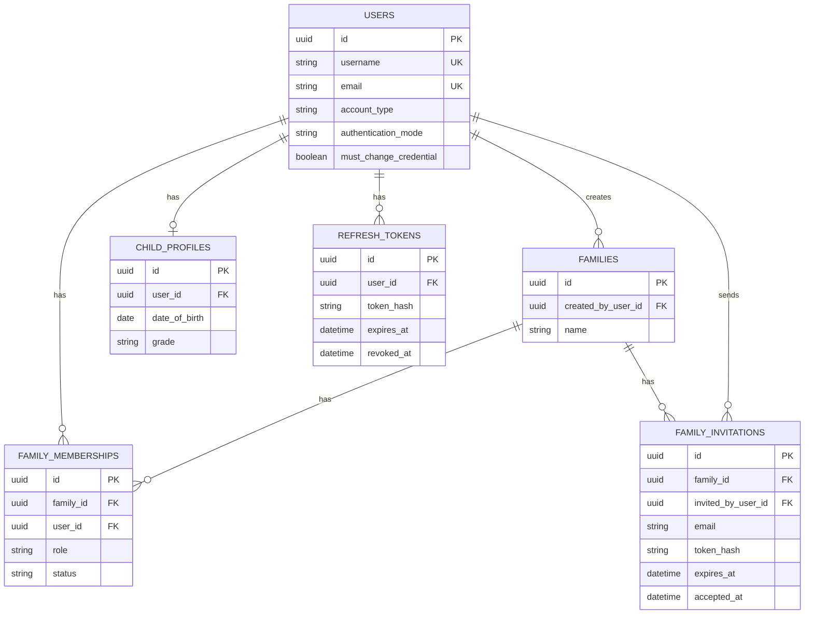

# Database Schema

The following planned ER diagram is consistent with the [identity and family](identity-and-family.md) architecture. Document entities and their ER extension are in [documents and RAG](documents-and-rag.md).

## Mermaid ER diagram

