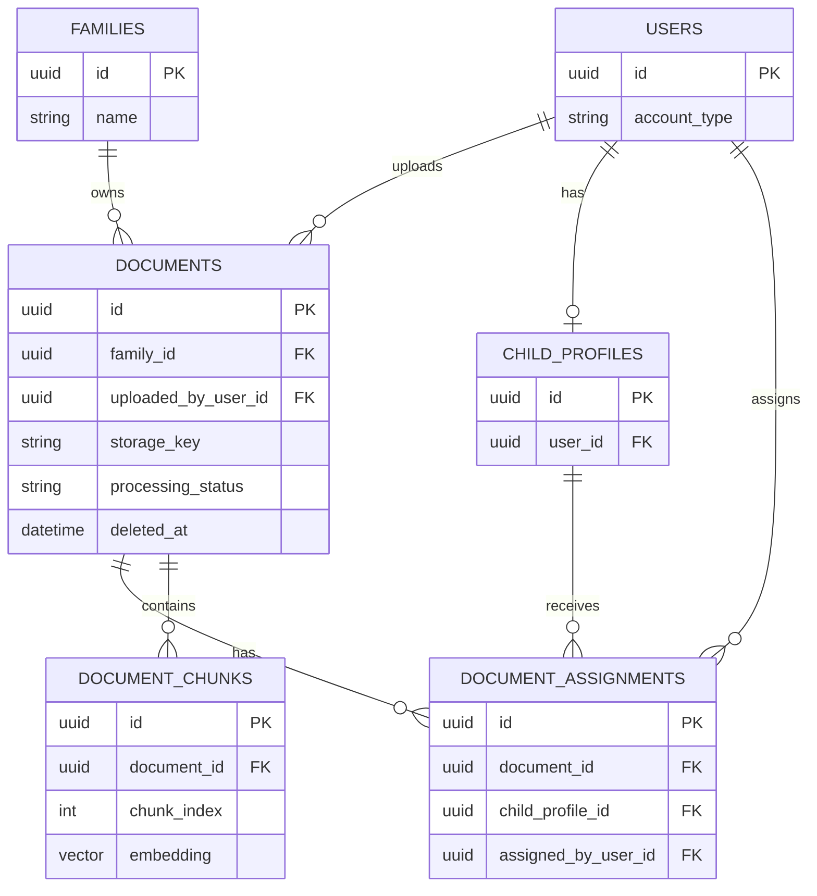
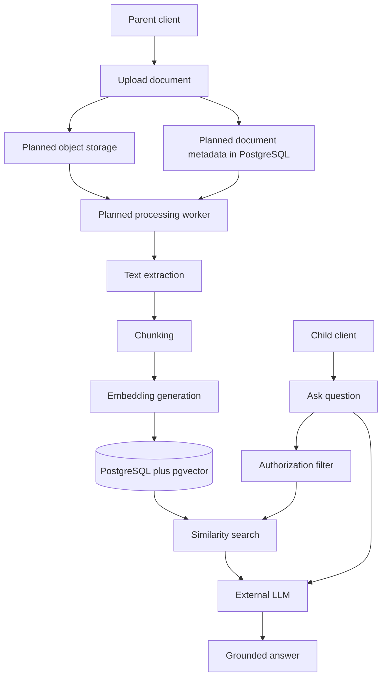

# Documents and RAG

This is the confirmed target architecture for documents and retrieval-augmented generation. Document upload, processing, object storage, background work, pgvector retrieval, and RAG endpoints are planned; none are implemented in the current backend.

## Document ownership

A `Document` belongs to one family and records its uploader separately. Suggested fields are `id`, `family_id`, `uploaded_by_user_id`, `title`, `original_filename`, `storage_key`, `mime_type`, `file_size` (nullable), `processing_status`, `processing_error` (nullable), `created_at`, `updated_at`, and `deleted_at` (nullable).

`family_id` establishes family ownership and `uploaded_by_user_id` provides attribution. A parent may manage documents only in a family where they have the required membership and role.

## File storage

The physical file is planned for S3-compatible object storage. PostgreSQL stores document metadata and the `storage_key` reference, rather than large document files. Files must not be stored directly in PostgreSQL unless a future requirement explicitly justifies that design.

## Document assignment

`DocumentAssignment` is the join table between `Document` and `ChildProfile`, allowing one document to be assigned to multiple children and each child to have multiple documents. Suggested fields are `id`, `document_id`, `child_profile_id`, `assigned_by_user_id`, and `assigned_at`.

The database must enforce uniqueness on `(document_id, child_profile_id)`. A family-owned document is not automatically visible to every child: it becomes visible only through explicit assignment, unless a future product decision introduces family-wide visibility.

## Document processing lifecycle

The planned lifecycle is `uploaded`, `queued`, `processing`, `ready`, and `failed`; exact status names may change during implementation. A document is ineligible for RAG retrieval until its status is `ready`.

Background jobs are a future requirement for text extraction, chunking, embedding generation, and retries. A background worker and Redis may be added when asynchronous processing is implemented; Redis is not required now.

## Document chunks and embeddings

`DocumentChunk` stores searchable extracted material with `id`, `document_id`, `chunk_index`, `content`, `page_number` (nullable), JSONB `metadata`, pgvector `embedding`, and `created_at`.

Enforce uniqueness on `(document_id, chunk_index)` and index `document_id`. The production schema must also provide appropriate pgvector indexes for the chosen similarity operator and query pattern.

The following planned ER extension is consistent with the family, user, and child-profile model above:

## Access-filtered retrieval

Vector similarity is not authorization. Every retrieval query must enforce the current authenticated child, valid family membership, assignment to that child, document readiness, non-deleted status, and future visibility rules.

Authorization filters must be applied in the database query, not only after retrieval in application memory. The system must never retrieve chunks from another family, a sibling's unassigned document, or a failed or deleted document.

PostgreSQL with pgvector remains the current decision because it provides one source of truth, simpler operations, relational filters and vector search in one query, easier consistency and backup strategy, and fewer infrastructure components. A dedicated vector database can be reconsidered only if scale, performance, or operational requirements justify it.

## RAG request flow

The planned pipeline is:

1. A parent uploads a document.
2. The file is stored in object storage and document metadata is created.
3. Processing starts: text is extracted, split into chunks, and embedded.
4. Chunks and embeddings are stored in PostgreSQL with pgvector.
5. A child asks a question, which is embedded.
6. The backend identifies the logged-in child and limits retrieval to that child's assigned, ready, non-deleted documents.
7. Eligible chunks are ranked by vector similarity.
8. Selected chunks and the question are sent to the LLM.
9. A grounded answer is returned; source references or citations may be added later.

## Failure handling

Failed processing sets the document status to `failed` and records error details safe for internal debugging. Processing must support retries and be idempotent where possible, including prevention of duplicate chunks on retry through the document/chunk uniqueness rule.

Object storage and PostgreSQL cannot share a normal database transaction. The implementation must therefore define transaction boundaries and compensating actions: clean up an uploaded file when metadata creation fails, and clean up or mark metadata failed when object storage upload fails. Retries must safely reconcile partial operations.

## Mermaid RAG flow diagram

See [authorization](authorization.md), [child profiles](child-profiles.md), and [open product decisions](open-decisions.md).
