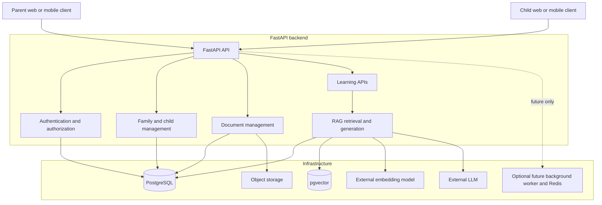

# System Overview

## Current repository state

The repository currently contains a small FastAPI backend with root (`/`) and health (`/health`) endpoints. It includes a `children` router with temporary in-memory CRUD endpoints:

- `POST /children`
- `GET /children`
- `GET /children/{id}`
- `PATCH /children/{id}`
- `DELETE /children/{id}`

Child data is held in a process-local Python list and is lost when the application restarts. The endpoint is a temporary API-learning foundation, not the planned family-aware child model.

PostgreSQL, SQLAlchemy, Alembic, authentication and authorization, access and refresh tokens, pgvector, object storage, RAG implementation, and the planned family workspace model are not yet implemented.

## Confirmed technology decisions

- Backend: FastAPI.
- Relational database and source of truth: PostgreSQL.
- ORM: SQLAlchemy 2.x.
- Database migrations: Alembic.
- Vector storage: PostgreSQL with pgvector; no separate vector database at this stage.
- File storage: S3-compatible object storage in production.
- Authentication: access tokens and refresh tokens.
- Redis: deferred until background jobs, caching, or rate limiting provides a real requirement.

## Architectural principles

1. Build incrementally, while making product-oriented decisions.
2. Do not introduce infrastructure before a real requirement justifies it.
3. PostgreSQL is the source of truth.
4. Authentication and authorization are separate concerns.
5. Every person who logs in is represented as a user.
6. A family is a shared workspace, not something conceptually owned by one parent.
7. A child has an independent login identity and a separate educational profile.
8. Shared resources belong to a family and are explicitly assigned to children.
9. RAG retrieval must enforce normal application authorization.
10. Architecture documentation evolves as decisions change.

## High-level system architecture

Parent and child clients authenticate independently with the FastAPI API. The API authenticates users, authorizes their actions against family membership and resource assignments, and exposes family and child management, document management, and learning APIs.

PostgreSQL stores transactional product data, including users, family workspaces, child educational profiles, resource assignments, and progress. pgvector runs within PostgreSQL to store and search embeddings for authorized RAG retrieval. Learning materials are stored in object storage, with their metadata and access relationships recorded in PostgreSQL.

For a learning request, the API authorizes the requesting user before retrieving only permitted material and vector results. It can then use an external embedding model and external LLM to generate a grounded response. A background worker and Redis are future optional components, introduced only when asynchronous work, caching, or rate limiting requires them.

## Mermaid system architecture diagram

See [database schema](database-schema.md) and [architecture decisions](architecture-decisions.md).
